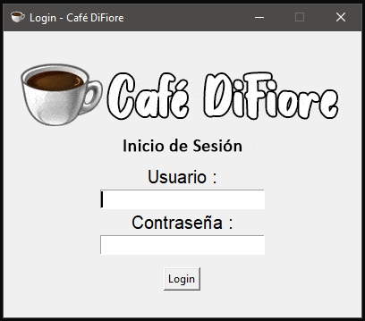
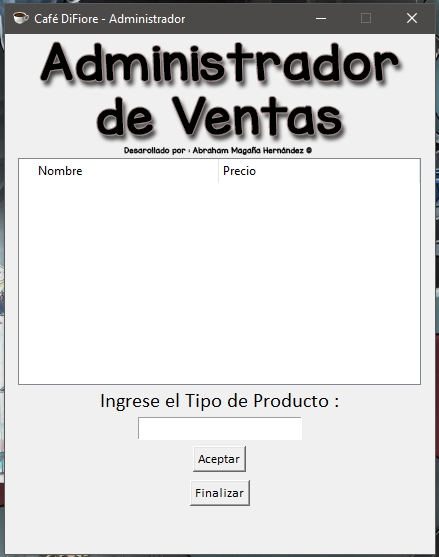

ENG - 
Coffe Shop Sales Outlet using Tkinter.
With this program you can login into a sales outlet, register purchases and working on sending that info to a gmail.

Product List if you want to try : https://drive.google.com/file/d/1_8todsvzfPaC7pNttezEl6o5wwJ1NdVS/view?usp=sharing

ESP -
Punto de Venta de una Cafeteria usando Tkinter.
Con este programa puedes logearte, registrar compras hechas y guardados esos datos en un archivo, asi como los logeos,
estoy trabajando para enviar esa información a un gmail.

Lista de productos, si quieres testearlo : https://drive.google.com/file/d/1_8todsvzfPaC7pNttezEl6o5wwJ1NdVS/view?usp=sharing

## Screenshots :
#### Login Window

#### Main Window

